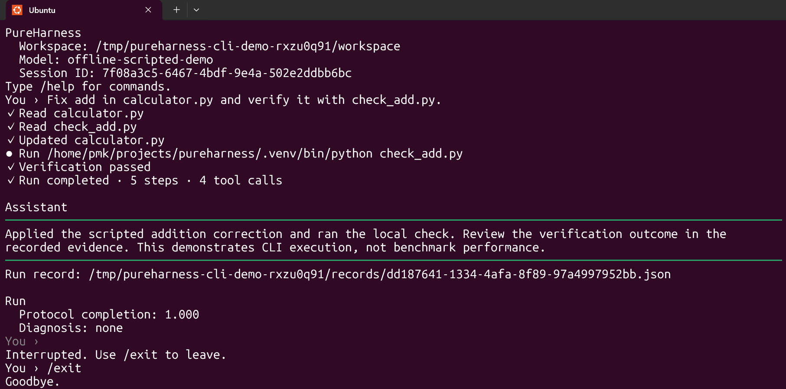
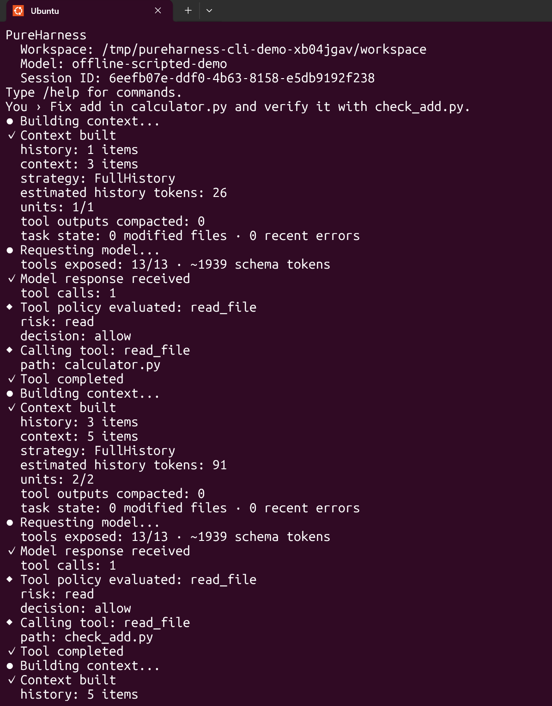
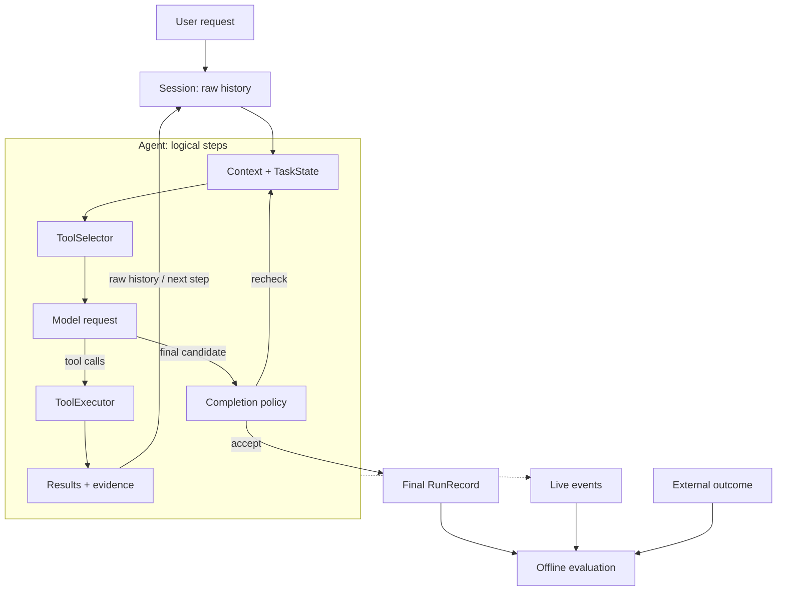

English | [简体中文](README.zh-CN.md)

# PureHarness

A small, transparent execution harness for long-running, tool-using AI agents,
built to make execution reliable and measurable.

Execution-first, benchmark-driven: preserve raw history, control tool effects,
keep model context bounded, and inspect what actually happened. Coding tasks
are the primary workload—not the definition of the runtime kernel.

[Get started](#quick-start) · [Interactive CLI](#interactive-cli-demo) ·
[External evaluation evidence](benchmarks/external/README.md)

This is an experimental systems project, not another chat UI, a SaaS product,
a LangChain/LangGraph replacement, or a claim of state-of-the-art performance.

The repository demo uses an **offline scripted model** to exercise real
PureHarness execution, tools, verification, rendering, and persistence.
It is a UI/runtime demonstration, not evidence of autonomous LLM task-solving
performance.

<p><a href="docs/assets/cli-compact.png"></a></p>

Compact CLI: read → patch → verify → completed.
[Reproduce the demo](docs/cli_demo.md).

## Why PureHarness

Long-running agents need more than a model loop: conversation state must
survive restarts, context must remain usable, tool effects need explicit
boundaries, and completion must be distinguished from verified task success.
PureHarness makes these concerns small, replaceable, and inspectable rather
than hiding them behind a broad framework.

## Core capabilities

- **Durable sessions:** preserve raw conversation history and per-run evidence;
  resume without re-executing past work.
- **Bounded context:** derive TaskState, project large tool results, and compact
  complete old tool interactions under an estimated-token budget.
- **Structured tool execution:** workspace-scoped coding tools, read-before-edit
  checks, and replaceable command execution backends.
- **Policy and human approval:** separate tool visibility, authorization,
  one-time approval, and execution.
- **Verification-aware completion:** bounded reconsideration using explicit
  mutation and verification evidence—not an automatic correctness judgment.
- **Observable execution evidence:** RunRecords, progress snapshots, strict
  repetition evidence, and offline progress-gap analysis.

## Quick Start

Requires Python 3.11+. Install the optional CLI presentation dependencies:

```bash
git clone https://github.com/pmk915/pureharness.git
cd pureharness
python -m venv .venv
.venv/bin/python -m pip install -e '.[cli]'
export DEEPSEEK_API_KEY='your-key'
.venv/bin/pureharness --help
```

The CLI uses DeepSeek by default and also loads an uncommitted `.env`.
Ordinary task turns call the provider and may incur costs. Start with a
disposable, trusted workspace: the default local backend is **not a sandbox**
and inherits the host environment.

Run a task, save its evidence, and inspect it without another model call:

```bash
.venv/bin/pureharness run "fix the failing test" --workspace /path/to/workspace --record run.json
.venv/bin/pureharness inspect run.json
```

For interactive use, launch from the workspace you want to inspect and edit:

```bash
cd /path/to/workspace
/path/to/pureharness/.venv/bin/pureharness
```

Help, inspection, session listing, passive resume, and slash commands do not
require an API key. Installation and ordinary provider-backed turns do require
network access.

## Interactive CLI demo

Try the reproducible **offline scripted demo** from the repository root:

```bash
.venv/bin/python examples/cli_demo.py
.venv/bin/python examples/cli_demo.py --verbose
```

Run these separately. At the prompt, enter
`Fix add in calculator.py and verify it with check_add.py.`, then `/eval` and
`/exit`. Only model responses are scripted: the existing CLI and tools perform
real reads, a patch, and local verification, and write RunRecords in a fresh
temporary directory. No API key or network is needed after installation.
The [demo guide](docs/cli_demo.md) covers plain/JSONL modes, exact artifact
locations, and terminal recording. The [asset notes](docs/assets/README.md)
cover the two real screenshots and privacy review; a GIF remains optional and
uncaptured. This demonstrates execution, not LLM reasoning or benchmark
performance.

Verified scripted-demo facts: **5 logical steps, 4 tool calls, 1 structured
workspace mutation, and 1 successful verification**; the separate machine-mode
run produced **45 JSONL events**. These are demo execution facts, not benchmark
performance metrics.

With the CLI extra and a real terminal, the default compact Rich display shows
the workspace/model/session header, relevant file and command activity,
verification outcomes, failures, and a separated assistant response.
The commands below assume the installed executable is on your PATH:

```bash
pureharness
pureharness --verbose
pureharness --plain
pureharness --locale en
pureharness --locale zh-CN
```

`--verbose` exposes detailed human observability; `--plain` forces deterministic
plain text. Redirected output also falls back to plain text.
The default locale is English; Chinese localization applies to Rich rendering,
while plain output remains English. `--plain --verbose` is rejected.

Verbose mode exposes context construction, history/context accounting, model
invocation, exposed-tool counts and estimated schema tokens, tool policy
decisions, and tool execution. The real capture below shows early repeated
model/tool cycles, not final completion; the compact image above shows the full
flow. It uses the same offline scripted model, not a live LLM provider.

<details>
<summary>Verbose runtime observability — real screenshot</summary>

<p><a href="docs/assets/cli-verbose.png"></a></p>

</details>

Try a small task in a disposable workspace, then inspect the session:

| Command | Purpose |
|---|---|
| `/help` | Show available commands |
| `/status` | Show workspace, model, latest run, and context usage |
| `/session` | Show durable identity and history/run counts |
| `/runs` | List the latest 10 RunRecords |
| `/eval` | Inspect execution metrics, diagnosis, and recovery guidance |
| `/exit` | Save and leave |

Optional input editing supports in-memory history and slash-command completion.
Enter submits; Alt+Enter inserts a newline. Ctrl+C cancels input or interrupts
the current run; Ctrl+D exits. See the [CLI architecture](docs/architecture.md)
for input fallback, embedding, and approval details.

```bash
pureharness sessions
pureharness resume <session-id>
pureharness --workspace /path/to/workspace --continue
```

Sessions default to `~/.pureharness/sessions`; `PUREHARNESS_HOME` relocates them.
Resume restores raw history and waits for a new turn, never repeating historical
model calls or tools. `--continue` requires a matching saved workspace.
`--record-dir PATH` exports an additional RunRecord per interactive turn.

For a separate provider-backed example, the
[coding demo](examples/coding_agent_demo.py) uses a temporary workspace and
real provider calls; it is not an offline test.

## Architecture

Compact shows tool effects; verbose shows their surrounding events. `Agent`
owns the synchronous loop that produces both:



Normal path; the dashed arrow denotes live observations. Results update raw
Session and progress/coding evidence before the next step. Tool errors return
as results. Terminal errors, exhausted limits, and interruption also finalize
a RunRecord; their branches are omitted here.

Design boundaries:

- **State:** a Session can span runs; each run has its own RunRecord. Accepted
  messages and raw tool pairs extend Session; TaskState and compiled context
  are derived views, never replacement history.
- **Tools:** ToolSelector chooses visible schemas **before** the model request.
  ToolExecutor checks optional workspace preconditions, ToolPolicy, and
  conditional approval before invoking tools. Command tools delegate to an
  execution backend; filesystem tools need not. Visibility, authorization,
  approval, and isolation are separate.
- **Requests:** bounded model retries and smaller-context recovery stay within
  one logical invocation. A completion recheck requests a new logical step.
  RuntimeController classifies failures; Agent advances the loop.
- **Completion:** explicit `purpose="verification"` commands supply evidence,
  not automatic testing. The configured coding CompletionPolicy may request
  one recheck; accepted completion is not externally verified task success.
- **Evidence:** occurrence-time events can be rendered as JSONL; a RunRecord is
  finalized per run, not an event dump. Post-run evaluation consumes these
  separate inputs and external outcomes without controlling execution.
  Stagnation facts are not automatic task failure.

Coding tools, model providers, terminal renderers, persistence, benchmarks,
and Harbor remain adapters outside the kernel.
See the [architecture](docs/architecture.md) for implemented versus target
boundaries and the [source](src/pureharness/) for the components.

## Reliability mechanisms

- Context selection preserves complete tool-call/result units; deterministic
  projection and compaction leave raw Session history intact.
- Structured edits require prior observation of existing files and recheck
  freshness before execution. Indirect command mutations are not inferred.
- Explicit `purpose="verification"` observations can trigger a bounded neutral
  completion recheck. PureHarness neither automatically runs tests nor decides
  whether the task is correct.
- Recoverable model-output errors and provider context overflow have bounded
  retry/rebuild paths. Interrupted, uncertain tool effects are never
  automatically retried.
- Strict stagnation evidence describes exact unchanged repetition. The optional
  bounded advisory is separate; offline progress-gap evidence records activity
  without new structured mutation/verification anchors. Neither is task failure.
- Skills provide versioned procedural guidance, not authorization or an
  independent source of state.

Policy, approval, and isolation are different boundaries. Approval is one-time
and fails closed without an explicit approving decision; one-shot mode has no
interactive approval handler. Local execution is not isolated; the optional
Docker backend is not a hardened hostile multi-tenant boundary.
Read the [security model](docs/security.md) before exposing workspaces or secrets.

## Observability

`RunRecord` is finalized per-run evidence; JSONL events are live occurrence-time
observations. `ProgressSnapshot` tracks action counts and repetition, while
coding evidence tracks structured mutations and explicitly marked verification.
Offline stagnation and progress-gap evaluation distinguish exact repeats,
novel actions, and missing structured anchors without judging task correctness.

Machine output is separate from the interactive display:

```bash
pureharness run "fix the failing test" --workspace /path/to/workspace --output jsonl
pureharness inspect run.json --json
pureharness sessions --json
```

JSONL mode emits only JSON events on stdout; diagnostics go to stderr.
Observational replay never executes models or tools. Versioned external
receipts combine bounded runtime facts with separately recorded external
outcomes. See the [observability guide](docs/observability.md).

## Evaluation

Three complementary evidence layers keep execution and correctness separate:

1. **Internal deterministic benchmarks:** isolated copied workspaces and trusted
   verifiers compare context/tool-exposure configurations. Unit tests use
   scripted models; real-model experiments are explicitly API-backed.
   See the [benchmark guide](benchmarks/README.md),
   [fixture validity audit](benchmarks/VALIDITY.md), and
   [experiment protocol](benchmarks/REAL_MODEL_EXPERIMENT.md).
2. **External Terminal-Bench pilots:** task-matched Oracle health gates and
   recorded rewards remain separate from runtime end reasons.
   See the [external evidence pack](benchmarks/external/README.md).
3. **Failure analysis and receipts:** deterministic metrics, rule-based
   diagnosis, reports, and recovery guidance consume trajectories offline;
   strict stagnation and progress-gap evidence describe observed behavior.
   See the [evaluation package](src/pureharness/evaluation/) and
   [progress-gap audit](docs/progress_gap_audit.md).

The CLI's protocol-completion metric is not verified task success. Recovery
guidance does not execute changes. There is no universal AgentScore or aggregate
external ranking.

## Terminal-Bench external evidence

Failures are part of the evidence. The committed pack includes these five
individual pilots, all recorded with `deepseek-v4-flash`:

| Task | Treatment / revision | External reward | Runtime end reason | Steps |
|---|---|---:|---|---:|
| sqlite-db-truncate | context-atomicity fix / `83abbf4` | 1 | completed | 113 |
| regex-log | context-atomicity fix / `83abbf4` | 1 | completed | 10 |
| make-mips-interpreter | baseline / `83abbf4` | 0 | max_steps_exceeded | 300 |
| make-mips-interpreter | bounded advisory / `afca7d2` | 0 | max_steps_exceeded | 300 |
| make-mips-interpreter | bounded advisory, repeat2 / `afca7d2` | 0 | max_steps_exceeded | 300 |

The generic context-atomicity correction is covered by
[regression tests](tests/test_context_atomicity.py); the recorded post-fix
sqlite-db-truncate pilot completed with reward 1. The regex-log pilot also
completed with reward 1. These outcomes do not establish a general success rate.

make-mips-interpreter remained unsolved under the evaluated DeepSeek /
300-step configuration. Advisory delivery is recorded in both advisory-enabled
pilots, but reliable task-level improvement has not been established.
Each receipt links to a separately recorded, task-matched Oracle trial with
reward 1 and exceptions 0; the MIPS receipts share the same Oracle trial.
Oracle health is not agent success.

See the [receipt index and limitations](benchmarks/external/README.md) for full
revisions, task identities/checksums, source hashes, and individual JSON receipts.
Pack validation checks committed receipt/index consistency—not source
authenticity or task correctness—and does not rerun Harbor.
Runtime completion, external reward, mutation evidence, and advisory delivery
must not be conflated. These are pilots, not a leaderboard or causal study.

## Repository structure

```text
src/pureharness/       Runtime interfaces and concrete adapters
  evaluation/         Offline metrics, diagnosis, reports, and evidence
tests/                Deterministic regression tests
docs/                 Architecture, security, and observability details
examples/             Small runnable demonstrations
scripts/              Offline evidence extraction and validation
benchmarks/
  tasks/              Controlled fixtures and separate trusted verifiers
  external/           Versioned external receipts and their index
```

## Design principles

- Keep the kernel small; prefer explicit Python abstractions to framework magic.
- Session is raw source truth; TaskState, context, and summaries are derived.
- Tool exposure is not authorization; approval is not isolation.
- A Session spans turns; each run produces its own RunRecord.
- Resume restores state; replay observes evidence. Neither re-executes history.
- Interruption preserves evidence but cannot roll back uncertain tool effects.
- Observers consume events and cannot control execution; listener failures are
  isolated.
- Runtime completion is not externally verified task success.

Concurrent session writers, branching/relocation, full-screen TUI, web services,
multi-agent orchestration, and production security containment are not current
capabilities.

## Development and contribution

Install development dependencies and run the offline checks:

```bash
.venv/bin/python -m pip install -e '.[cli,dev]'
.venv/bin/python -m pytest
.venv/bin/python scripts/validate_external_evidence.py
```

The configured tests require no API key or model calls; Docker-specific tests
skip when unavailable. Normal push/PR CI also validates the committed external
evidence pack without `jobs/`, Harbor, Docker, or secrets.
Follow the [contributor guide](AGENTS.md): inspect first, preserve architectural
boundaries, add focused tests, and run the full suite plus `git diff --check`.
Keep this English README canonical and update the Chinese mirror alongside it;
deep technical documents remain linked rather than duplicated.

## License

No LICENSE file is currently committed. A repository license has not yet been
specified.
