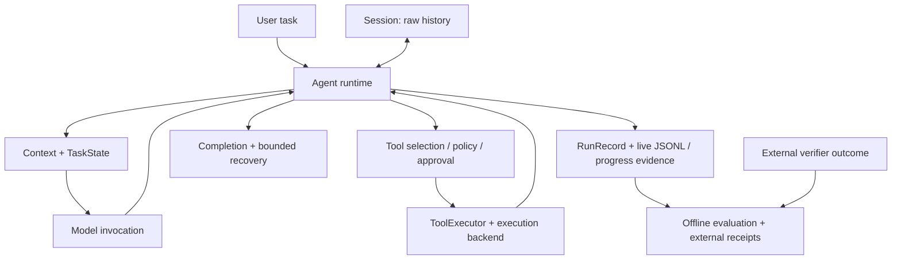

[English](README.md) | 简体中文

# PureHarness

一个小巧、透明的执行 Harness，面向长时间运行、使用工具的 AI Agent，
让执行过程更可靠、可衡量。

执行优先，基准驱动：保留原始历史、控制工具副作用、约束模型上下文，
并让实际发生的执行过程可检查。编码任务是主要工作负载，而不是运行时内核的定义。

[快速开始](#快速开始) · [交互式 CLI](#交互式-cli-演示) ·
[外部评测证据](benchmarks/external/README.md)

这是一个实验性系统项目，不是另一个聊天 UI、SaaS 产品、
LangChain/LangGraph 替代品，也不宣称具有最先进的基准性能。

## 为什么做 PureHarness

长时间运行的 Agent 需要的不只是模型循环：会话状态应能跨重启保留，
上下文应持续可用，工具副作用应有明确边界，结束执行也应与经过验证的任务成功区分开。
PureHarness 将这些关注点实现为小巧、可替换、可检查的组件，
而不是隐藏在庞大的框架之中。

## 核心能力

- **持久会话：** 保存原始对话历史和每次运行的证据；恢复时不重新执行过去的操作。
- **有界上下文：** 在估算 token 预算下派生 TaskState、投影大型工具结果，
  并压缩完整的旧工具交互。
- **结构化工具执行：** 工作区范围内的编码工具、编辑前读取检查，以及可替换的命令执行后端。
- **策略与人工审批：** 分离工具可见性、授权、一次性审批和实际执行。
- **验证感知的完成判断：** 根据显式修改与验证证据进行有界重新考虑，
  而不是自动判断任务是否正确。
- **可观察的执行证据：** RunRecord、进展快照、严格重复证据，以及离线进展间隔分析。

## 快速开始

需要 Python 3.11 或更高版本。安装可选的 CLI 呈现依赖：

```bash
git clone https://github.com/pmk915/pureharness.git
cd pureharness
python -m venv .venv
.venv/bin/python -m pip install -e '.[cli]'
export DEEPSEEK_API_KEY='your-key'
.venv/bin/pureharness --help
```

CLI 默认使用 DeepSeek，也会加载未提交的 `.env`。
普通任务对话会调用模型提供方，可能产生费用。请先使用可丢弃的可信工作区：
默认本地后端**不是沙盒**，并会继承宿主环境。

运行一个任务，保存执行证据，然后在不再次调用模型的情况下检查记录：

```bash
.venv/bin/pureharness run "fix the failing test" --workspace /path/to/workspace --record run.json
.venv/bin/pureharness inspect run.json
```

交互使用时，从希望检查和编辑的工作区启动：

```bash
cd /path/to/workspace
/path/to/pureharness/.venv/bin/pureharness
```

帮助、记录检查、会话列表、被动恢复和斜杠命令不需要 API key。
安装和普通的模型任务对话需要网络访问。

## 交互式 CLI 演示

安装 CLI extra 并使用真实终端时，默认紧凑 Rich 界面会展示工作区、模型和会话信息，
相关文件与命令活动、验证结果、失败，以及单独呈现的助手回答。
以下命令假定已安装的可执行文件位于 PATH 中：

```bash
pureharness
pureharness --verbose
pureharness --plain
pureharness --locale en
pureharness --locale zh-CN
```

`--verbose` 展示详细的人类可读观测信息；`--plain` 强制使用确定性的纯文本。
重定向输出也会回退到纯文本。
默认语言为英语；中文本地化适用于 Rich 呈现，纯文本输出仍为英语。
`--plain --verbose` 组合会被拒绝。

在可丢弃的工作区尝试一个小任务，然后检查会话：

| 命令 | 用途 |
|---|---|
| `/help` | 显示可用命令 |
| `/status` | 显示工作区、模型、最近运行和上下文用量 |
| `/session` | 显示持久身份及历史、运行数量 |
| `/runs` | 列出最近 10 个 RunRecord |
| `/eval` | 检查执行指标、诊断和恢复建议 |
| `/exit` | 保存并退出 |

可选输入编辑支持内存中的历史记录和斜杠命令补全。
Enter 提交，Alt+Enter 插入换行；Ctrl+C 取消输入或中断当前运行，Ctrl+D 退出。
输入回退、嵌入和审批细节见 [CLI 架构说明](docs/architecture.md)。

```bash
pureharness sessions
pureharness resume <session-id>
pureharness --workspace /path/to/workspace --continue
```

会话默认存储在 `~/.pureharness/sessions`；可用 `PUREHARNESS_HOME` 更改位置。
恢复会加载原始历史并等待新一轮输入，不会重放历史模型调用或工具。
`--continue` 要求存在与工作区匹配的已保存会话。
`--record-dir PATH` 可为每轮交互额外导出一份 RunRecord。

本节预留给未来的可视化操作演示，目前不包含截图或录制演示。
另有一个 [编码演示](examples/coding_agent_demo.py)，使用临时工作区并调用真实模型，
不是离线测试。

## 架构



运行时协调窄接口。编码工具、模型提供方、终端渲染器、持久化、基准和 Harbor
都是内核之外的适配器。TaskState 和上下文是 Session 的派生视图，不替代原始历史。
评估层消费证据，不控制执行。
已实现与目标边界见 [架构文档](docs/architecture.md)，组件见 [源码](src/pureharness/)。

## 可靠性机制

- 上下文选择保留完整的工具调用与结果单元；确定性的投影和压缩不改动 Session 原始历史。
- 结构化编辑要求先观察已有文件，并在执行前重新检查新鲜度；不推断命令造成的间接修改。
- 显式 `purpose="verification"` 观测可触发有界、中立的完成复查。
  PureHarness 不自动运行测试，也不判断任务是否正确。
- 可恢复的模型输出错误和提供方上下文溢出有有界重试或重建路径。
  已中断且副作用不确定的工具不会被自动重试。
- 严格停滞证据描述精确、结果不变的重复。可选的有界 advisory 与之分离；
  离线进展间隔证据记录没有新增结构化修改或验证锚点的活动。两者都不等于任务失败。
- Skills 提供版本化的流程指导，不是授权，也不是独立状态源。

策略、审批和隔离是不同边界。审批是一次性的，没有显式批准就拒绝执行；
单次运行模式没有交互审批处理器。本地执行没有隔离；可选 Docker 后端也不是
面向恶意多租户负载的加固安全边界。
暴露工作区或秘密之前，请阅读 [安全模型](docs/security.md)。

## 可观测性

`RunRecord` 是每次运行最终形成的证据；JSONL 事件是发生时刻的实时观测。
`ProgressSnapshot` 跟踪动作数量和重复；编码证据跟踪结构化修改及显式标记的验证。
离线停滞与进展间隔评估区分精确重复、新动作和缺少结构化锚点，
但不判断任务正确性。

机器输出与交互显示分离：

```bash
pureharness run "fix the failing test" --workspace /path/to/workspace --output jsonl
pureharness inspect run.json --json
pureharness sessions --json
```

JSONL 模式的 stdout 只包含 JSON 事件，诊断信息写入 stderr。
观测式回放不执行模型或工具。版本化外部 receipt 将有界运行时事实与单独记录的
外部结果组合起来。详见 [可观测性指南](docs/observability.md)。

## 评估

三个互补的证据层让执行事实与正确性保持分离：

1. **内部确定性基准：** 使用隔离的工作区副本和可信验证器，
   比较上下文与工具暴露配置。单元测试使用脚本模型，真实模型实验则显式调用 API。
   见 [基准指南](benchmarks/README.md)、
   [fixture 有效性审计](benchmarks/VALIDITY.md) 和
   [实验协议](benchmarks/REAL_MODEL_EXPERIMENT.md)。
2. **外部 Terminal-Bench 试点：** 任务匹配的 Oracle 健康检查与记录的 reward
   独立于运行时结束原因。见 [外部证据包](benchmarks/external/README.md)。
3. **失败分析与 receipt：** 确定性指标、规则诊断、报告和恢复建议离线消费轨迹；
   严格停滞与进展间隔证据描述观察到的行为。
   见 [评估包](src/pureharness/evaluation/) 和
   [进展间隔审计](docs/progress_gap_audit.md)。

CLI 的协议完成指标不是经过验证的任务成功。恢复建议不执行修改。
没有通用 AgentScore，也没有外部综合排名。

## Terminal-Bench 外部证据

失败也是证据的一部分。已提交证据包包含以下五次单独记录的试点，
记录的模型均为 `deepseek-v4-flash`：

| 任务 | 处理条件 / 版本 | 外部 reward | 运行时结束原因 | 步数 |
|---|---|---:|---|---:|
| sqlite-db-truncate | 上下文原子性修复 / `83abbf4` | 1 | completed | 113 |
| regex-log | 上下文原子性修复 / `83abbf4` | 1 | completed | 10 |
| make-mips-interpreter | baseline / `83abbf4` | 0 | max_steps_exceeded | 300 |
| make-mips-interpreter | 有界 advisory / `afca7d2` | 0 | max_steps_exceeded | 300 |
| make-mips-interpreter | 有界 advisory，repeat2 / `afca7d2` | 0 | max_steps_exceeded | 300 |

通用上下文原子性修正有 [回归测试](tests/test_context_atomicity.py) 覆盖；
记录的修复后 sqlite-db-truncate 试点以 reward 1 完成。
regex-log 试点也以 reward 1 完成。这些结果不构成一般性的成功率。

在所评估的 DeepSeek / 300 步配置下，make-mips-interpreter 仍未解决。
两次启用 advisory 的试点均记录了 advisory 送达，但尚未确立可靠的任务层面改善。
每份 receipt 都关联单独记录的、与任务匹配的 Oracle 运行，结果为 reward 1、
exceptions 0；MIPS 的 receipt 共用同一次 Oracle 运行。
Oracle 健康不等于 Agent 成功。

完整版本、任务身份与 checksum、来源哈希和各份 JSON receipt 见
[receipt 索引与限制](benchmarks/external/README.md)。
证据包校验检查已提交 receipt 与索引的一致性，不认证来源、不判断任务正确性，
也不重新运行 Harbor。
运行时完成、外部 reward、修改证据和 advisory 送达不能混为一谈。
这些是试点，不是排行榜或因果研究。

## 仓库结构

```text
src/pureharness/       Runtime interfaces and concrete adapters
  evaluation/         Offline metrics, diagnosis, reports, and evidence
tests/                Deterministic regression tests
docs/                 Architecture, security, and observability details
examples/             Small runnable demonstrations
scripts/              Offline evidence extraction and validation
benchmarks/
  tasks/              Controlled fixtures and separate trusted verifiers
  external/           Versioned external receipts and their index
```

## 设计原则

- 内核保持小巧，优先使用显式 Python 抽象，而不是框架魔法。
- Session 是原始事实源；TaskState、上下文和摘要都是派生视图。
- 工具暴露不是授权，审批不是隔离。
- 一个 Session 跨越多轮对话，每次运行各自产生一份 RunRecord。
- 恢复加载状态，回放观察证据；两者都不重新执行历史操作。
- 中断保留证据，但不能回滚不确定的工具副作用。
- 观察者消费事件，不控制执行；监听器失败相互隔离。
- 运行时完成不是经过外部验证的任务成功。

当前不支持同一会话并发写入、分支或工作区迁移、全屏 TUI、Web 服务、
多 Agent 编排或生产级安全隔离。

## 开发与贡献

安装开发依赖并运行离线检查：

```bash
.venv/bin/python -m pip install -e '.[cli,dev]'
.venv/bin/python -m pytest
.venv/bin/python scripts/validate_external_evidence.py
```

配置的测试不需要 API key，也不调用模型；Docker 专项测试在不可用时跳过。
常规 push/PR CI 也会校验已提交的外部证据包，不需要 `jobs/`、Harbor、
Docker 或秘密。
遵循 [贡献指南](AGENTS.md)：先检查、保持架构边界、添加针对性测试，
并运行完整测试和 `git diff --check`。
英文 README 是主版本，请同步更新中文镜像；深入技术文档通过链接引用，不重复翻译。

## 许可证

当前没有提交 LICENSE 文件，仓库许可证尚未明确。
